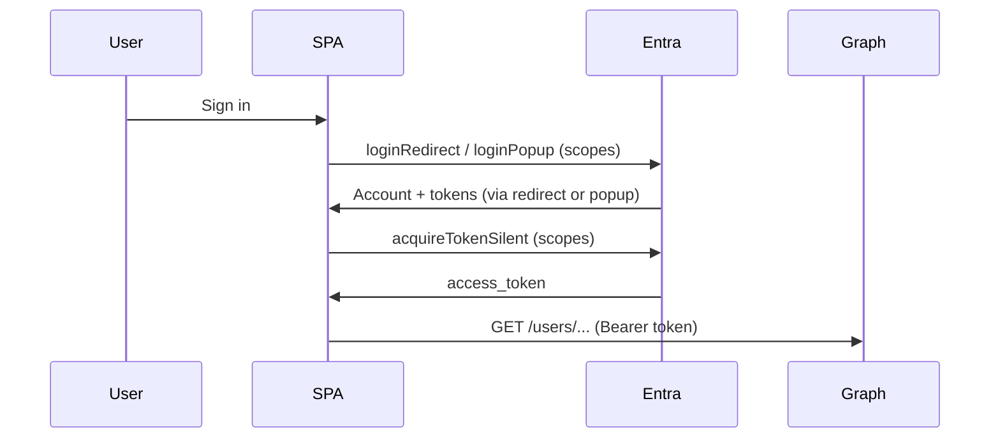

# Azure MSAL + Microsoft Graph: Profile Photos & Directory

Generic pattern for a **single-page app (SPA)** that uses **delegated** Microsoft Graph permissions. No backend token exchange required for read-only profile and directory features described here.

---

## When to use this skill

- User signs in with **Microsoft** (work/school account).
- You need **profile photos** for a known set of users (by UPN or email).
- You need **directory search** (typeahead by display name) across the tenant.
- You need optional fields like **job title** from user profiles.

**Out of scope here:** sending mail, calendar write, app-only (client credentials) Graph, on-behalf-of flows, or storing photos in your own database (unless the product explicitly requires it).

---

## Prerequisites

### 1. Entra ID app registration

| Setting | Guidance |
|--------|----------|
| **Supported account types** | Usually single tenant (this organization only). |
| **Platform** | **Single-page application** — not “Web” confidential client for browser-only MSAL. |
| **Redirect URIs** | Every origin you use (e.g. `https://app.example.com/`, `http://localhost:5173/`). Must match **exactly** (trailing slash included if registered that way). |
| **Client ID** | Public; safe in frontend config. |
| **Tenant ID** | Use in authority URL: `https://login.microsoftonline.com/{tenant-id}`. |

### 2. Microsoft Graph API permissions (delegated)

| Permission | Typical use |
|------------|-------------|
| **User.Read** | Signed-in user’s own profile; required baseline for login. |
| **User.ReadBasic.All** | Read other users’ **basic** profile: display name, mail, photo, and basic fields like job title when addressed by id/UPN. |

**Admin consent:** `User.ReadBasic.All` often requires **tenant admin consent**. Without it, silent token acquisition or Graph calls may return 403.

**Stronger permissions (only if needed):** `User.Read.All` or `Directory.Read.All` broaden directory visibility; prefer the minimum permission that satisfies the product. `$search` on users may still work with `User.ReadBasic.All` in many tenants when using the patterns below.

### 3. Frontend libraries

- **@azure/msal-browser** — `PublicClientApplication`, `loginRedirect` / `loginPopup`, `acquireTokenSilent`.
- Plain **`fetch`** (or your HTTP client) to call Graph with the access token.

### 4. MSAL configuration (conceptual)

```javascript
const msalConfig = {
  auth: {
    clientId: "<APPLICATION_CLIENT_ID>",
    authority: "https://login.microsoftonline.com/<TENANT_ID>",
    redirectUri: "<APP_ORIGIN>/", // must match app registration
  },
  cache: {
    cacheLocation: "localStorage", // or sessionStorage
    storeAuthStateInCookie: false,
  },
};

const loginRequest = {
  scopes: ["User.Read", "User.ReadBasic.All"],
};
```

---

## Authentication flow

1. **Initialize** MSAL once at app startup: `await msalInstance.initialize()`.
2. **Handle redirect return:** `await msalInstance.handleRedirectPromise()` after login redirect.
3. **Sign in:** `msalInstance.loginRedirect(loginRequest)` or `loginPopup(loginRequest)`.
4. **Active account:** `msalInstance.setActiveAccount(account)`; read `account.username` (usually UPN/email).
5. **Graph access token** before each batch of Graph calls:

```javascript
const scopes = ["User.Read", "User.ReadBasic.All"];

async function getGraphToken(account) {
  try {
    const result = await msalInstance.acquireTokenSilent({ scopes, account });
    return result.accessToken;
  } catch {
    const result = await msalInstance.acquireTokenPopup({ scopes, account });
    return result.accessToken;
  }
}
```

All Graph requests: `Authorization: Bearer <accessToken>`.



---

## Profile photos (known users)

Use when you already have a list of **identifiers** (UPN, email, or Graph user id).

### By email or UPN

Try sized photo first, then default:

```http
GET https://graph.microsoft.com/v1.0/users/{upnOrEmail}/photos/240x240/$value
GET https://graph.microsoft.com/v1.0/users/{upnOrEmail}/photo/$value
```

### By Graph user id

```http
GET https://graph.microsoft.com/v1.0/users/{userId}/photo/$value
```

### Client handling

1. Obtain token via `getGraphToken(account)`.
2. `fetch` with `Authorization` header.
3. If `response.ok`, `const blob = await response.blob()`; display via `URL.createObjectURL(blob)` (revoke URLs on unmount if many users).
4. If **404** — user has **no photo** in Microsoft 365; show initials or placeholder. **Do not treat 404 as auth failure.**
5. Optionally parallelize with `Promise.all` over your user list; respect throttling for large lists.

### Job title (optional, same user)

```http
GET https://graph.microsoft.com/v1.0/users/{upnOrEmail}?$select=jobTitle,displayName,mail
```

---

## Directory search (typeahead)

Use for **searching the tenant** by display name (e.g. picker for “add colleague”).

### Request

```http
GET https://graph.microsoft.com/v1.0/users?$search="displayName:{query}"&$select=displayName,mail,id,jobTitle&$top=8
```

**Required header:**

```http
ConsistencyLevel: eventual
```

Without `ConsistencyLevel: eventual`, `$search` may fail or behave incorrectly.

### Client example

```javascript
async function searchDirectory(token, query) {
  const q = query.trim();
  if (q.length < 2) return [];

  const url =
    `https://graph.microsoft.com/v1.0/users?$search=` +
    `"displayName:${encodeURIComponent(q)}"` +
    `&$select=displayName,mail,id,jobTitle&$top=8`;

  const res = await fetch(url, {
    headers: {
      Authorization: `Bearer ${token}`,
      ConsistencyLevel: "eventual",
    },
  });
  if (!res.ok) return [];

  const { value = [] } = await res.json();
  return value.filter((u) => u.mail);
}
```

### Photos for search results

For each result, optionally:

```http
GET https://graph.microsoft.com/v1.0/users/{id}/photo/$value
```

Same 404 / placeholder rules as above.

### Alternatives to `$search`

- **`$filter`** on `startswith(displayName,'...')` — simpler but less flexible; may need different permissions or indexing behavior.
- **Microsoft Graph SDK** — same endpoints and headers; SDK does not remove permission or consent requirements.

---

## Security and product notes

| Topic | Guidance |
|-------|----------|
| **Delegated only** | The signed-in user’s token defines what Graph returns; tenant policies may hide some users. |
| **Do not log tokens** | Access tokens in browser memory only; never commit secrets for SPA Graph reads. |
| **Cache** | Do not put Graph photo or `/users` API responses in a **service worker** cache; use network or short-lived in-memory/blob URLs. |
| **Rate limits** | N+1 photo fetches for large directories — batch, cache in session, or move hot paths to a backend with caching. |
| **PII** | Mail, display name, job title are directory PII — handle per org policy. |

---

## Troubleshooting

| Symptom | Likely cause |
|---------|----------------|
| Login redirect loop / `redirect_uri` error | Redirect URI mismatch in Entra vs app config. |
| 403 on Graph | Missing permission or missing **admin consent** for `User.ReadBasic.All`. |
| 404 on `/photo/$value` | No profile picture set in Entra/M365 — expected for many users. |
| Empty `$search` results | Query too short, typo, `ConsistencyLevel` header missing, or tenant restricts directory read. |
| `acquireTokenSilent` fails | Consent revoked, session expired — fall back to `acquireTokenPopup` or re-login. |

---

## Minimal implementation checklist

- [ ] Entra SPA app registration with correct redirect URIs  
- [ ] Delegated permissions: `User.Read`, `User.ReadBasic.All` (+ admin consent)  
- [ ] MSAL `PublicClientApplication` + `loginRequest` scopes  
- [ ] `handleRedirectPromise` on load  
- [ ] `getGraphToken(account)` before Graph calls  
- [ ] Photos: `/photos/240x240/$value` → fallback `/photo/$value`; handle 404  
- [ ] Directory: `$search` on `displayName` with `ConsistencyLevel: eventual`  
- [ ] UI placeholders when photo or search fails  

---

## Reference links

- [Microsoft identity platform — SPA quickstart](https://learn.microsoft.com/en-us/entra/identity-platform/quickstart-single-page-app-sign-in)
- [MSAL.js](https://github.com/AzureAD/microsoft-authentication-library-for-js)
- [Get user photo](https://learn.microsoft.com/en-us/graph/api/profilephoto-get)
- [List users with $search](https://learn.microsoft.com/en-us/graph/search-query-parameter)
